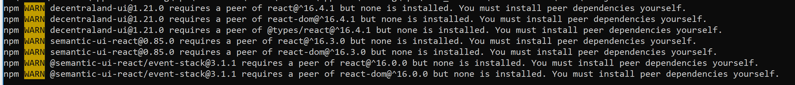
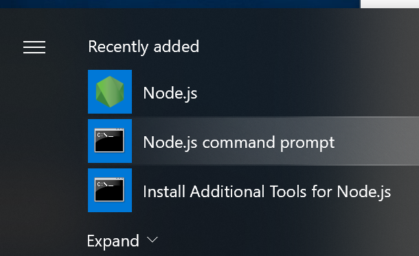

Getting started with the Decentraland SDK can be quite simple.  They have a great guide at https://docs.decentraland.org/development-guide/SDK-101/ that you can check out, or you can follow these steps below:

1) Install Node if you dont already have it from https://nodejs.org/en/download/
2) create a working folder for your decentraland project

    Mac - open Terminal
  
    Windows - open `node.js command prompt` from the Start Menu
  
    Both - type `mkdir decentraland`
  
    Both - type `cd decentraland`
  
3) initialize a Decentraland scene in your new folder by typing `npm install -g decentraland`

    you may see messages similar to these which can be ignored
    
4) play!

Install node from https://nodejs.org/en/download/ if you dont already have it.

Windows:

From the start window, type node.js.  If you see `node.js command prompt`, then click on it. 

Mac:
Open Terminal by using Finder and typing `terminal`
From the Terminal window that was opened, type `node -v`
If you see this message 
`-bash: node: command not found`

Check to see if you have Node

Install Node from https://nodejs.org/en/download/

Windows:  Download the windows installer, accept all the defaults
Mac: ???

Windows:  open node.js command prompt
Run npm install -g decentraland

Ignore warnings, or fix them

create a folder to start, mkdir testDCL
Make Chrome your default web browser in Windows

Do Mac steps with pictures

