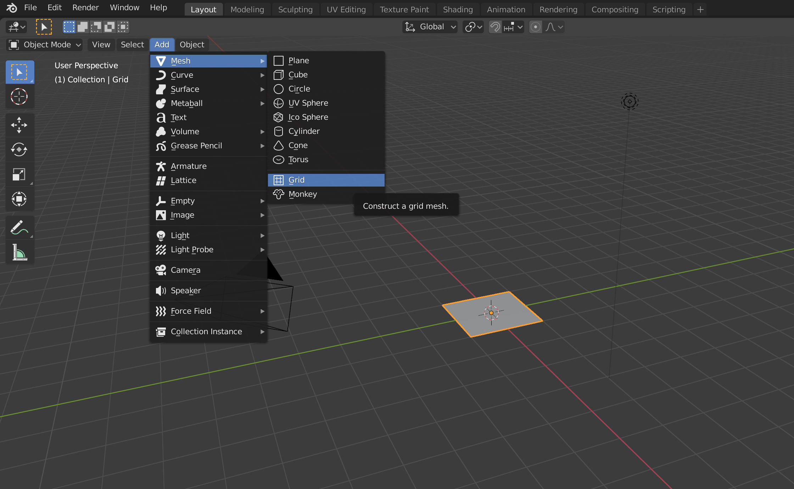

# Decentraland-hitTesting
Create a model in Blender and then interact with it from a scene in Decentraland

First, we need a model to do testing on.  If you dont already have it, go to https://www.blender.org/download/ and get the latest version of blender.  Its free, its full of features, and it creates the types of files needed in Decentraland.

Open blender and click on New File -> General:

When the new file opens, a cube will be selected (highlighted with orange around the edges).  Hit the "X" key and confirm that you want to delete the cube:

Click on Add -> Mesh -> Grid to get a new grid that we can use to create various areas to hit test on:

Type "S" to scale the plane and move your mouse until the coordinates show that its roughly 3.0000 X 3.0000 X 3.0000 (it does not have to be exact)

From the Scene Collection, expand the Grid and select the Grid that you just created so the grid will be displayed

Select the vertices (points) around a 2 X 2 grid in the top corner.  You will need to select the vertice in the center of the collection as well:

Right-click on the selection you just created and click on Separate -> Selection:

You will now see that your selection is no longer a part of the original grid, and that it has its own entry in the Scene Collection - `Grid.001`

